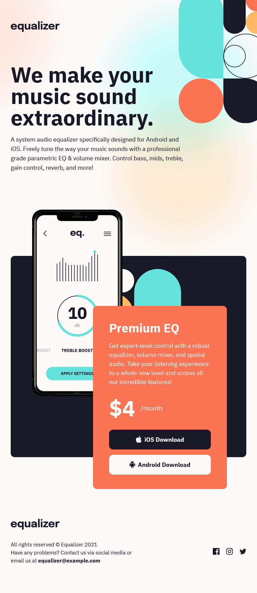

# Frontend Mentor - Equalizer landing page solution

This is a solution to the [Equalizer landing page challenge on Frontend Mentor](https://www.frontendmentor.io/challenges/equalizer-landing-page-7VJ4gp3DE). Frontend Mentor challenges help you improve your coding skills by building realistic projects.

## Table of contents

-   [Overview](#overview)
    -   [The challenge](#the-challenge)
    -   [Screenshot](#screenshot)
    -   [Links](#links)
-   [My process](#my-process)
    -   [Built with](#built-with)
    -   [What I learned](#what-i-learned)
    -   [Useful resources](#useful-resources)
-   [Author](#author)

## Overview

### The challenge

Users should be able to:

-   View the optimal layout depending on their device's screen size
-   See hover states for interactive elements

### Screenshot

#### Mobile

#### Tablet

#### Desktop

### Links

-   Solution URL: [Add solution URL here](https://your-solution-url.com)
-   [Live Site URL](https://mgalvizo.github.io/equalizer-landing-page/)

## My process

### Built with

-   Semantic HTML5 markup
-   SASS/SCSS
-   Flexbox
-   Mobile-first approach
-   Webpack Bundler

### What I learned

Using media breakpoints to make the necessary adjustments to the design so it looks good in different screen sizes.

### Useful resources

-   [Media Queries MDN](https://developer.mozilla.org/en-US/docs/Web/CSS/Media_Queries/Using_media_queries) - This article contains enough information on how to use media queries.

## Author

-   Frontend Mentor - [@mgalvizo](https://www.frontendmentor.io/profile/mgalvizo)
